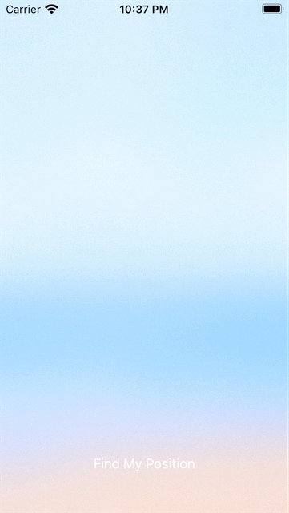
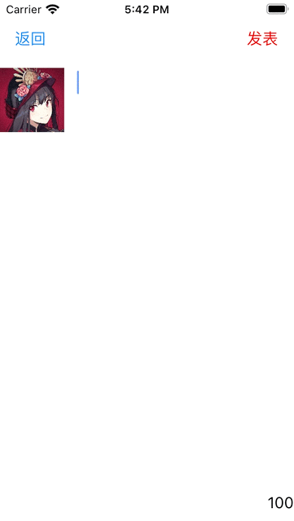
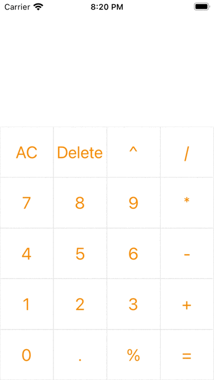

## Swift Project

参考 [100 Days of Swift](https://samvlu.com/index.html) 
大部分使用纯代码实现，使用storyboard会特殊说明

### StopWatch

### CustomFonts

### FindMyPosition

### LimitedInputTextField

### Calculator

### Weather

